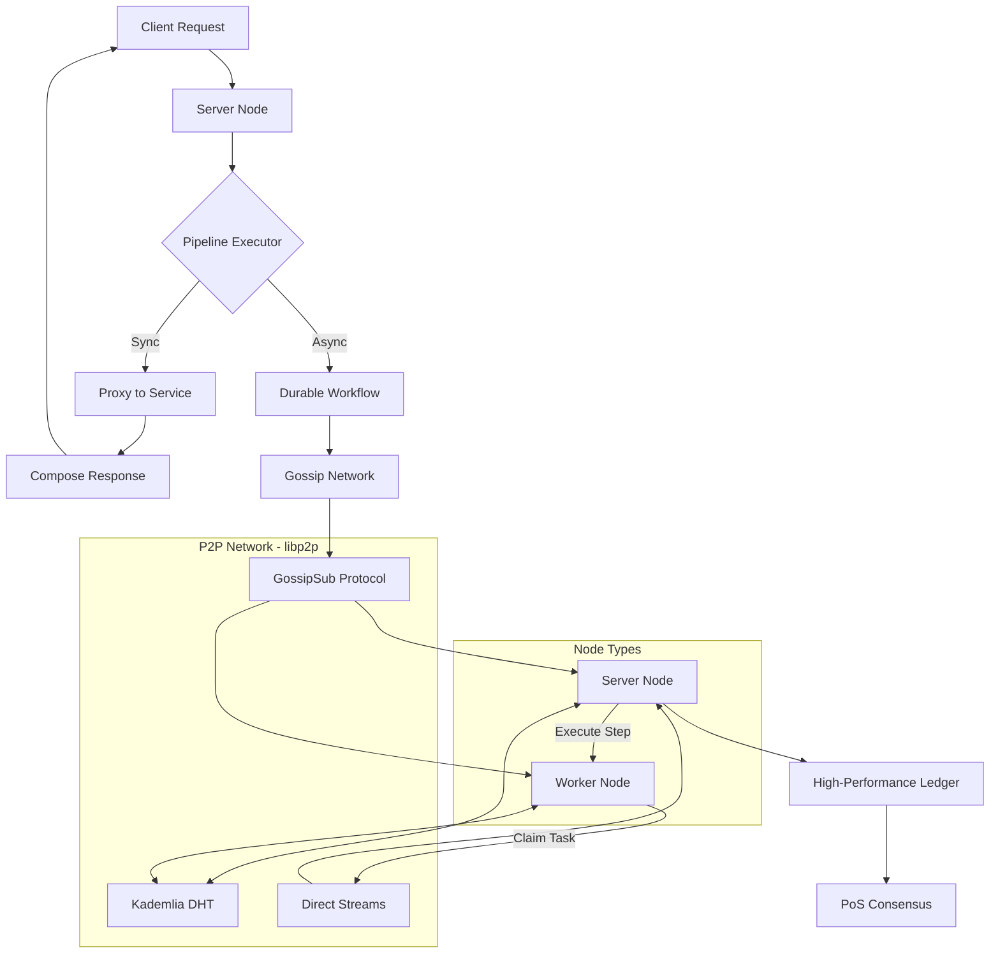

# 🚀 Grapthway Protocol v1.0

<div align="center">


**A Sovereign Execution Protocol for Decentralized Applications**

*Transform any Web2 service into a resilient, high-performance decentralized application without sacrificing performance or sovereignty.*

[](https://hub.docker.com/r/farisbahdlor/grapthway-protocol)
[](LICENSE.md)

[🎯 Quick Start](#-quick-start) • [🏗️ Architecture](#-architecture) • [💡 Core Concepts](#-core-concepts) • [📖 Documentation](#-documentation)

</div>

---

## 🌟 What is Grapthway?

Grapthway is a **fully decentralized protocol** designed to manage, secure, and orchestrate communication between microservices. It eliminates the false choice between Web2 performance and Web3 sovereignty by combining:

- **Decentralized Orchestration**: Define complex, multi-step workflows in simple JSON that coordinate calls across GraphQL and REST services
- **Durable Workflows**: Execute long-running, asynchronous processes with guaranteed completion and automatic failure recovery
- **Incentivized Economic Layer**: A built-in, high-performance ledger with the **Grapthway Compute Unit (GCU)** token that creates a sustainable economy

Instead of relying on centralized databases or message brokers, Grapthway leverages a **peer-to-peer network** built on libp2p to create a resilient, scalable, and self-sustaining ecosystem.

---

## 🏗️ Architecture

Grapthway operates as a **hybrid Layer 1 protocol** where:
- A purpose-built L1 blockchain handles **economic settlement, token operations, and network security**
- Complex application logic runs on the highly scalable **off-chain Sovereign Execution Layer**

This separation allows Web2-level performance while maintaining Web3 sovereignty.

### High-Level System Architecture



### Node Roles

Grapthway nodes can operate in two distinct roles:

**Server Nodes (`server`)**
- Public-facing entry points for API requests
- Execute synchronous orchestration pipelines
- Act as coordinators for durable workflows
- Participate in economic layer and consensus

**Worker Nodes (`worker`)**
- Headless background processors
- Execute steps of long-running workflows
- Do not expose public API
- Essential for asynchronous capabilities

---

## 💡 Core Concepts

### 1. Decentralized Orchestration

Define how services interact using declarative JSON configurations. Grapthway handles authentication, data enrichment, and distributed transactions without writing custom code.

```json
{
  "service": "products-service",
  "schema": "type Query { getProduct(id: ID!): Product }",
  "type": "graphql",
  "middlewareMap": {
    "getProduct": {
      "pre": [{
        "service": "auth-service",
        "field": "validateSession",
        "onError": { "stop": true }
      }]
    }
  }
}
```

### 2. Durable Workflows

Long-running processes that survive node failures through automatic checkpointing and recovery:

```json
{
  "service": "orchestration-service",
  "type": "graphql",
  "middlewareMap": {
    "order.fulfillment.workflow": {
      "isWorkflow": true,
      "isDurable": true,
      "pre": [
        {
          "service": "payment-api",
          "method": "POST",
          "path": "/charge",
          "retryPolicy": { "attempts": 3, "delaySeconds": 60 }
        },
        {
          "service": "inventory-service",
          "field": "reserveItems",
          "onError": { "stop": true }
        }
      ]
    }
  }
}
```

### 3. Economic Layer

The **GCU token** powers all network operations:
- Developers pay for compute resources
- Node operators earn rewards for infrastructure
- Secured by Proof-of-Stake consensus

**Staking Requirements**: `Required Stake = CPU Cores × 100 GCU`

### 4. P2P Architecture

Built on libp2p with no central points of failure:

- **GossipSub**: State updates and task announcements propagate through the network
- **Kademlia DHT**: Decentralized storage for service configs and workflow state
- **Stake-Based Handshake**: Prevents under-provisioned or malicious nodes from joining
- **Direct Streams**: Fast consensus messaging between validators

---

## 🎯 Quick Start

### Prerequisites
- Docker and Docker Compose
- Basic understanding of GraphQL or REST APIs

### Step 1: Create Node Wallets

Start a temporary node to create wallets for your network:

```bash
# Start temporary node
docker run -d -p 5000:5000 --name grapthway-temp \
  farisbahdlor/grapthway:decentralized-v1.0

# Create wallet
curl -X POST http://localhost:5000/admin/wallet/create

# Save the privateKey securely!
# Repeat for each node you plan to run

# Cleanup
docker stop grapthway-temp && docker rm grapthway-temp
```

### Step 2: Create docker-compose.yml

```yaml
version: '3.8'

services:
  grapthway-node-1:
    image: farisbahdlor/grapthway:decentralized-v1.0
    container_name: grapthway-node-1
    ports:
      - "5001:5000"
      - "40951:40949"
    environment:
      - PORT=5000
      - P2P_PORT=40949
      - NODE_OPERATOR_PRIVATE_KEY=YOUR_NODE_1_PRIVATE_KEY
    volumes:
      - ./data/node-1:/data
    networks:
      grapthway-net:
        ipv4_address: 172.20.0.10

  grapthway-node-2:
    image: farisbahdlor/grapthway:decentralized-v1.0
    container_name: grapthway-node-2
    ports:
      - "5002:5000"
      - "40952:40949"
    environment:
      - PORT=5000
      - P2P_PORT=40949
      - NODE_OPERATOR_PRIVATE_KEY=YOUR_NODE_2_PRIVATE_KEY
      - BOOTSTRAP_PEERS=/ip4/172.20.0.10/tcp/40949/p2p/NODE_1_PEER_ID
    volumes:
      - ./data/node-2:/data
    depends_on:
      - grapthway-node-1
    networks:
      grapthway-net:

  grapthway-worker-1:
    image: farisbahdlor/grapthway:decentralized-v1.0
    container_name: grapthway-worker-1
    environment:
      - GRAPTHWAY_ROLE=worker
      - P2P_PORT=40949
      - NODE_OPERATOR_PRIVATE_KEY=YOUR_WORKER_1_PRIVATE_KEY
      - BOOTSTRAP_PEERS=/ip4/172.20.0.10/tcp/40949/p2p/NODE_1_PEER_ID
    volumes:
      - ./data/worker-1:/data
    depends_on:
      - grapthway-node-1
    networks:
      grapthway-net:

networks:
  grapthway-net:
    driver: bridge
    ipam:
      config:
        - subnet: 172.20.0.0/16
```

### Step 3: Launch Network

```bash
# Start first node
docker-compose up -d grapthway-node-1

# Get Peer ID from logs
docker logs grapthway-node-1
# Look for: "P2P Node started with ID: 12D3Koo..."

# Update BOOTSTRAP_PEERS in docker-compose.yml with the Peer ID

# Launch full network
docker-compose up -d
```

### Step 4: Verify Network

```bash
# Check node status
curl http://localhost:5001/admin/gateway-status

# View hardware stats
curl http://localhost:5001/admin/hardware-stats
```

---

## 🔧 Core Features

### Transactional Pipelines with Rollbacks

Ensure data consistency across microservices with automatic compensating actions:

```json
{
  "createUser": {
    "pre": [
      {
        "service": "user-db-service",
        "field": "insertUser",
        "assign": { "newUser": "" },
        "onError": {
          "stop": true,
          "rollback": [{
            "service": "user-db-service",
            "field": "deleteUserById",
            "argsMapping": { "id": "newUser.id" }
          }]
        }
      },
      {
        "service": "email-api-service",
        "method": "POST",
        "path": "/send-welcome-email",
        "bodyMapping": { "email": "newUser.email" },
        "onError": { "stop": true }
      }
    ]
  }
}
```

### Conditional Execution

Execute steps based on runtime context:

```json
{
  "service": "audit-log-service",
  "method": "POST",
  "path": "/log-admin-action",
  "conditional": "user.role == 'admin'",
  "bodyMapping": {
    "action": "Product Deletion",
    "productId": "args.productId"
  }
}
```

### Delegated Transactions

Enable automated, secure micropayments:

```json
{
  "ledgerExecute": {
    "from": "args.payerAddress",
    "to": "context.developerAddress",
    "amount": 1000
  },
  "onError": { "stop": true }
}
```

### Built-in Token System

Production-grade, on-chain token operations:

- **TOKEN_CREATE**: Create custom tokens with configurable economics
- **TOKEN_TRANSFER**: Transfer tokens between addresses
- **TOKEN_APPROVE/REVOKE**: ERC-20-like allowance system
- **TOKEN_MINT/BURN**: Dynamic supply management
- **TOKEN_LOCK**: Permanently lock token configuration

---

## 📊 Performance & Scalability

### Measured Performance

On a modest 3-node cluster (2 vCPUs, 2GB RAM per node):
- **~500 TPS** (token transfers)
- **~1000 OPS** (including aggregated operations)
- **~500 ops/second/core** processing capacity

### Scalability Architecture

**Vertical Scalability**
- Parallelized block production pipeline
- Multi-core optimized transaction processing
- Scales linearly with CPU cores

**Horizontal Scalability**
- Byzantine Fault Tolerant (BFT) consensus
- Tolerates `f` failures where `N = 3f + 1`
- Self-healing P2P topology

---

## 🔒 Security Model

### Zero-Trust Architecture

- **No Bearer Tokens**: All actions authorized by cryptographic signatures
- **ECDSA secp256k1**: Industry-standard signature verification
- **Stake-Based Admission**: Prevents Sybil attacks
- **Content-Addressed Storage**: Tamper-proof configurations

### Node Identity

A single private key (`NODE_OPERATOR_PRIVATE_KEY`) controls:
- P2P network identity (libp2p Peer ID)
- Economic wallet (staking and rewards)
- Administrative access

**⚠️ Critical**: Store private keys securely. Never commit to source control.

---

## 🛠️ Configuration Reference

| Variable | Description | Default |
|----------|-------------|---------|
| `GRAPTHWAY_ROLE` | Node role: `server` or `worker` | `server` |
| `PORT` | Public API port (server nodes only) | `5000` |
| `P2P_PORT` | libp2p network communication port | `40949` |
| `NODE_OPERATOR_PRIVATE_KEY` | Hex-encoded private key for node identity | Generated |
| `BOOTSTRAP_PEERS` | Comma-separated multiaddresses of bootstrap nodes | - |
| `LOG_RETENTION_DAYS` | Days to retain historical logs | `7` |

---

## 📈 Observability

### Admin Dashboard

Access at `http://localhost:5000/admin`

**Features:**
- Live log streaming (WebSocket)
- Hardware monitoring (local and network-wide)
- Workflow execution tracking
- Ledger transaction explorer
- P2P network topology visualization

### Log Types

- **Gateway Logs**: Full API request/response lifecycle
- **Ledger Logs**: Economic activity audit trail
- **Admin Logs**: Administrative action records
- **Live Logs**: Real-time system events

### API Endpoints

```bash
# Network status
GET /admin/gateway-status

# Hardware statistics
GET /admin/hardware-stats

# Registered services
GET /admin/services

# Workflow monitoring
GET /admin/workflows/monitoring

# Historical logs
GET /admin/logs/{type}?start={timestamp}&end={timestamp}
```

---

## 👨‍💻 Developer Workflow

### 1. Create Developer Wallet

Request wallet creation from any node operator:

```bash
# Create wallet address or using our html admin dashboard
curl -X POST http://localhost:5001/admin/wallet/create
```

### 2. Fund Account with GCU

Ensure sufficient balance for API operations:

```bash
# Transfer GCU to developer address or using our html admin dashboard
curl -X POST http://localhost:5001/ledger/transfer
```

### 3. Sign and Publish Service Configuration

Use the Grapthway JS Client for canonical signing:

```javascript
import { grapthwayClient } from './grapthway-client.js';

const config = {
  service: "my-service",
  schema: "type Query { hello: String }",
  type: "graphql",
  middlewareMap: {}
};

const { canonicalJson, signature } = grapthwayClient.signConfig(config);
await grapthwayClient.publish(canonicalJson, signature, "my-service");
```

### 4. Access Service

Services are namespaced by developer wallet:

```bash
POST /{developer_address}/{service}/graphql
```

---

## 🌍 Use Cases

### API Monetization Platform
- Register REST/GraphQL APIs with automatic metering
- Users pay per-request in GCU or custom tokens
- Built-in authentication and rate limiting

### Multi-Service Orchestration
- Coordinate payment processing, AI inference, and data storage
- Automatic rollback on failures
- Fault-tolerant workflow execution

### Token-Gated Access
- Require minimum token balance for API access
- Useful for membership platforms and premium content
- DAO governance integration

### Decentralized Finance (DeFi)
- Custom tokens with configurable burn/mint mechanics
- Automated trading bots using allowances
- Lending protocols with workflow-based liquidation

### Real World Assets (RWA)
- Tokenize physical goods
- Track custody transfers with workflows
- Immutable provenance chain

---

## 🔄 High Availability

### Automatic Workflow Recovery

When a coordinator node fails:

1. **Detection**: Worker detects unreachable coordinator
2. **State Retrieval**: Worker queries DHT for last checkpoint
3. **Recovery Proposal**: Worker broadcasts takeover proposal
4. **Consensus**: Other servers verify and approve
5. **Takeover**: New coordinator resumes workflow

**Result**: Zero data loss, automatic recovery without manual intervention

---

## 🚀 Production Deployment

### Kubernetes Recommended

```yaml
apiVersion: apps/v1
kind: Deployment
metadata:
  name: grapthway-server
spec:
  replicas: 3
  selector:
    matchLabels:
      app: grapthway-server
  template:
    metadata:
      labels:
        app: grapthway-server
    spec:
      containers:
      - name: grapthway
        image: farisbahdlor/grapthway:decentralized-v1.0
        env:
        - name: GRAPTHWAY_ROLE
          value: "server"
        - name: NODE_OPERATOR_PRIVATE_KEY
          valueFrom:
            secretKeyRef:
              name: grapthway-keys
              key: node-key
        ports:
        - containerPort: 5000
          name: api
        - containerPort: 40949
          name: p2p
        resources:
          requests:
            cpu: 2
            memory: 4Gi
          limits:
            cpu: 4
            memory: 8Gi
```

### Best Practices

- **Use Ingress Controller**: Handle TLS termination (NGINX, Traefik)
- **Separate Deployments**: Scale server and worker nodes independently
- **Network Policies**: Restrict downstream service access to Grapthway pods only
- **Persistent Volumes**: Mount `/data` for ledger persistence
- **Secret Management**: Store private keys in Kubernetes Secrets or Vault
- **Monitoring**: Integrate with Prometheus/Grafana

---

## 📚 Documentation

### Official Resources

- 📄 [White Paper](white_paper_end.html) - Protocol vision and technical architecture
- 📖 [Engineering Manual](engineering_manual.html) - Complete technical reference
- 🔧 [API Reference](engineering_manual.html) - Comprehensive API docs

### Community

- 💬 [Whatsapp](https://chat.whatsapp.com/JeSmPrptaJY4IhZ7E3p1E1) - Updates and announcements
- 🐛 [GitHub Issues](https://github.com/Grapthway/Grapthway-Protocol/issues) - Bug reports
- 💡 [Discussions](https://github.com/Grapthway/Grapthway-Protocol/discussions) - Feature requests

---

## 🤝 Contributing

We welcome contributions from the community!

### Ways to Contribute

- 🐛 Report bugs and issues
- 💡 Propose new features
- 📖 Improve documentation
- 🔧 Submit pull requests
- 🧪 Test and provide feedback

### Development Setup

```bash
# Clone repository
git clone https://github.com/Grapthway/Grapthway-Protocol.git
cd Grapthway-Protocol

# Install dependencies
go mod download

# Build binary
go build -o grapthway ./cmd/grapthway
```

---

## 🆚 Comparison

| Feature | Grapthway | AWS/GCP | Ethereum | Solana |
|---------|-----------|---------|----------|--------|
| **Architecture** | Hybrid L1 + Off-Chain | Centralized | Monolithic Blockchain | Monolithic Blockchain |
| **TPS** | 500+ (2 vCPU) | Unlimited | ~15 | ~65,000 theoretical |
| **Finality** | 2.5 seconds | Instant | ~13 minutes | ~400ms |
| **Developer Experience** | Any language/stack | Excellent | Poor (Solidity only) | Poor (Rust only) |
| **Smart Contracts** | Off-chain Pipelines | N/A | On-chain (EVM) | On-chain (BPF) |
| **Cost Model** | Predictable (fixed GCU) | Variable | Volatile (gas market) | Volatile (priority fees) |
| **Sovereignty** | High (Protocol Owned) | Low (Platform Owned) | High (Protocol Owned) | High (Protocol Owned) |
| **Censorship Resistance** | High (P2P) | Low (Central Control) | High (Decentralized) | Medium (Validator Concentration) |
| **Native Tokens** | Built-in | N/A | Smart contract required | Smart contract required |

---

## 📄 License

Grapthway is available under a custom software license.  
Please read the full agreement: [LICENSE.md](LICENSE.md)

---

## 🙏 Acknowledgments

Built with ❤️ by the Grapthway team.

**Special Thanks:**
- **libp2p** and **IPFS** communities for decentralized networking foundations
- Early adopters and beta testers who helped battle-test the protocol
- The GraphQL and REST communities for continuous inspiration
- Contributors and open source maintainers worldwide

---

<div align="center">

**Transform your microservices into sovereign applications**

[🚀 Get Started](#-quick-start) • [📖 Read White Paper](whitepaper.md) • [💬 Join Whatsapp](https://chat.whatsapp.com/JeSmPrptaJY4IhZ7E3p1E1)

---

*Web2 Performance. Web3 Sovereignty. No Compromise.*

[](https://libp2p.io/)
[](https://golang.org/)
[](https://web3.foundation/)

</div>
