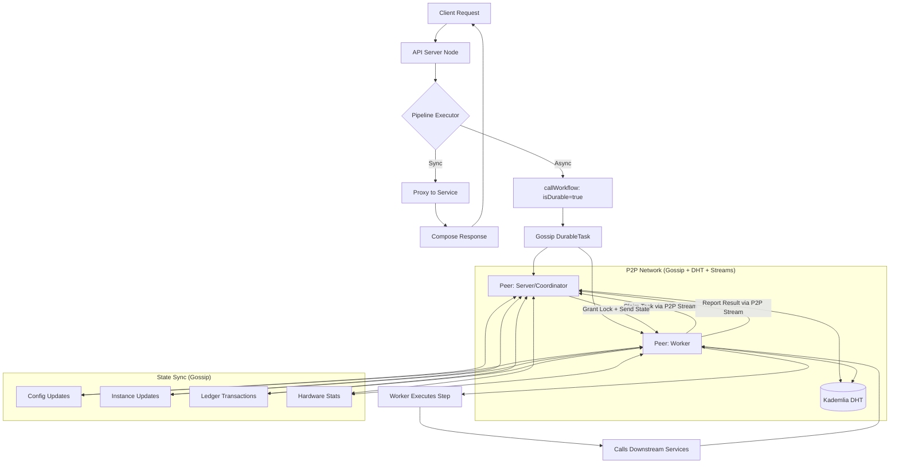

# 🚀 Grapthway v3.0 (Decentralized)

<div align="center">


**A Globally Unified, Decentralized, and Shared Infrastructure for the Internet**

*Join the world's first peer-to-peer network for unifying and orchestrating GraphQL & REST microservices. Build on shared, resilient infrastructure that no single entity controls.*

[](https://hub.docker.com/r/farisbahdlor/grapthway)
[](https://github.com/Grapthway)
[](LICENSE.md)

[🎯 Quick Start](#-quick-start) • [✨ What's New](#-whats-new-in-v30) • [🏗️ Architecture](#-architecture) • [🔧 Examples](#-orchestration-examples) • [📖 Documentation](#-documentation)

</div>

---

## ✨ What's New in v3.0? The Global Decentralized Protocol

Grapthway v3.0 transforms from a traditional API gateway into a **globally shared, decentralized infrastructure**. Instead of running your own isolated protocol, you join a worldwide network of nodes that collectively provide a unified, resilient foundation for the internet's microservices.

### 🔥 Headline Features

<table>
<tr>
<td width="50%">

#### 🌍 Global Unified Network
- **Join, don't build**: Connect to the existing global Grapthway network
- **Shared infrastructure**: Benefit from worldwide distributed resources
- **Collective resilience**: Network grows stronger with each new participant

</td>
<td width="50%">

#### 🚀 Built on Decentralized Foundations
- **100% Peer-to-Peer**: No central servers, databases, or dependencies
- **Kademlia DHT** for robust, content-addressable storage and peer discovery
- **P2P Workflow Engine** for reliable, fault-tolerant background tasks

</td>
</tr>
<tr>
<td>

#### 📊 Global Observability
- Nodes share hardware stats for a real-time, worldwide view of network capacity
- The Admin Dashboard provides local and global monitoring views
- Distributed tracing and logging provide deep insights into every request

</td>
<td>

#### 🛡️ Atomic Ledger & Economy
- Transaction-based gossip prevents double-spending without a slow blockchain
- The **Grapthway Compute Unit (GCU)** token powers all network operations
- All operations are atomic, ensuring data integrity across the network

</td>
</tr>
</table>

---

## 🏗️ Architecture

The v3.0 architecture represents a **globally unified network** where nodes worldwide collaborate to provide shared infrastructure. When you run a Grapthway node, you're joining this global network, not creating an isolated instance.

### System Architecture (Global Network)



The API Server Node that receives the initial request for a durable workflow also acts as a decentralized Coordinator for that specific workflow instance, arbitrating task claims from the Worker network over secure P2P streams.

---

## 🎯 Quick Start

Run a multi-node Grapthway cluster on your local machine using Docker.

### 1. Run the Bootstrap Node
This first `server` node acts as the entry point for the network.

```bash
docker run -d --name grapthway-node-1 \
  --cpus="1" \
  --memory="1g" \
  -p 5001:5000 \
  -p 40949:40949 \
  -v "$(pwd)/grapthway-data-1:/data" \
  -e GRAPTHWAY_ROLE="server" \
  -e NODE_OPERATOR_PRIVATE_KEY="150f8cb472212bd8f5f94b67397fb9b66c7bb4f0914d3674b199d76908fdf79c" \
  your-docker-image/grapthway:latest
```

### 2. Get the Bootstrap Peer Address
Fetch the full P2P multiaddress of the first node from its logs. You'll need this for all other nodes.

```bash
docker logs grapthway-node-1

# Look for a line like:
# Node listening on address: /ip4/172.17.0.2/tcp/40949/p2p/12D3KooW...
# Copy this full address.
```

### 3. Run Additional Peers
Start other `server` and `worker` nodes, pointing them to the bootstrap address.

> ⚠️ **CRITICAL:** For a stable production network, every single node and worker **MUST** have a unique `NODE_OPERATOR_PRIVATE_KEY`. Using the same key for multiple containers will cause network instability and connection failures.

```bash
# Replace BOOTSTRAP_PEER_ADDRESS with the address you copied.

# Start a second server node
docker run -d --name grapthway-node-2 \
  --cpus="1" \
  --memory="1g" \
  -p 5002:5000 \
  -p 40948:40948 \
  -e P2P_PORT="40948" \
  -e BOOTSTRAP_PEERS="BOOTSTRAP_PEER_ADDRESS" \
  -e GRAPTHWAY_ROLE="server" \
  -e NODE_OPERATOR_PRIVATE_KEY="4ea9247ff9897329d2cdc2e22e2415523c43fe27e8a34d22099db218c17e0ba1" \
  your-docker-image/grapthway:latest

# Start a worker node
docker run -d --name grapthway-worker-1 \
  --cpus="1" \
  --memory="1g" \
  -e GRAPTHWAY_ROLE="worker" \
  -e NODE_OPERATOR_PRIVATE_KEY="c2a513224b2151475753732ee4b61d556e43f1191a2b16859e9a623f33bbf140" \
  -e BOOTSTRAP_PEERS="BOOTSTRAP_PEER_ADDRESS" \
  your-docker-image/grapthway:latest
```

---

## 🔧 Orchestration Examples

The core orchestration syntax remains the same, but now it's executed by a resilient, decentralized network.

### 1. Transactional Pipeline with Rollback

If creating a user in the database succeeds but sending the welcome email fails, the rollback action is automatically triggered to delete the user, preventing orphaned data across your services.

```javascript
// Attached to GraphQL mutation: createUser(details: UserInput!): User
"createUser": {
  "pre": [
    {
      "service": "user-db-service",
      "field": "insertUser",
      "argsMapping": { "details": "args.newUserDetails" },
      "assign": { "newUser": "" },
      "onError": {
        "stop": true,
        "rollback": [{
          "service": "user-db-service",
          "field": "deleteUserById",
          "argsMapping": { "id": "newUser.id" }
        }]
      }
    },
    {
      "service": "email-api-service",
      "method": "POST",
      "path": "/send-welcome-email",
      "bodyMapping": { "email": "newUser.email" },
      "onError": { "stop": true } 
    }
  ]
}
```

### 2. Triggering a P2P Durable Workflow

The `placeOrder` mutation completes instantly for the user, while the complex fulfillment logic is reliably executed in the background by the decentralized network of worker nodes.

```javascript
// PIPELINE (attached to the `placeOrder` GraphQL mutation)
"placeOrder": {
  // The main mutation runs first...
  "post": [
    {
      // After the order is saved, trigger the durable workflow by name.
      "callWorkflow": "order.fulfillment.workflow",
      // Pass data from the main mutation's result into the workflow's context.
      "argsMapping": {
        "orderId": "id",
        "items": "items"
      }
    }
  ]
}

// WORKFLOW DEFINITION (registered separately)
"order.fulfillment.workflow": {
  "isWorkflow": true,
  "isDurable": true, // Ensures reliability via P2P workers.
  "pre": [
    {
      "service": "shipping-api-rest",
      "method": "POST",
      "path": "/v1/labels",
      "bodyMapping": { "orderId": "args.orderId" },
      "retryPolicy": { "attempts": 5, "delaySeconds": 300 }
    },
    // ... more steps for inventory, notifications, etc.
  ]
}
```

### 3. Multi-Tenant Service Registration

Services are now isolated by wallet address, enabling secure multi-tenancy.

```javascript
// Register a service for a specific tenant (wallet address)
{
  "service": "products-service",
  "url": "http://tenant-products:8000",
  "type": "graphql",
  "subgraph": "0x1234567890abcdef...", // Developer's wallet address
  "schema": "type Query { getProduct(id: ID!): Product } type Product { id: ID name: String }",
  "middlewareMap": {
    "getProduct": {
      "pre": [{
        "service": "auth-service",
        "field": "validateSession",
        "onError": { "stop": true }
      }]
    }
  }
}
```

Access the service via: `POST /0x1234567890abcdef.../products/graphql`

---

## 🌟 Key Features

<div align="center">

| **🌍 Global Infrastructure** | **🛡️ Production Features** |
|---|---|
| **Join the Global Grapthway Network** | **Atomic Ledger & GCU Economy** |
| **Native Multi-Tenancy via Wallet Addresses** | **Global Hardware Monitoring** |
| **Unified GraphQL & REST Orchestration** | **Durable Workflow Engine** |
| **Dynamic Schema Stitching** | **Zero-Trust Security Model** |
| **Worldwide Service Discovery** | **Real-time Admin Dashboard** |
| **Transactional Pipelines with Rollbacks** | **Distributed Tracing & Logging** |

</div>

---

## 📊 Architecture Highlights

### Global Network Participation
- **Network Discovery**: Your nodes automatically discover and connect to the global Grapthway network
- **Shared State**: Participate in the worldwide gossip network for configurations, instances, and transactions
- **Collective Resources**: Contribute to and benefit from the global pool of compute and storage resources
- **Universal Access**: Your services become accessible through the global network infrastructure

### Multi-Tenant Security
- **Cryptographic Isolation**: Each tenant identified by unique wallet address
- **Signed Configurations**: All service configs cryptographically signed by developer
- **Zero-Trust Model**: All inter-node communication is verified and authenticated
- **Immutable Storage**: Configurations stored in content-addressable DHT

---

## 🌍 Joining the Global Network

### The Vision: Unified Internet Infrastructure
Instead of each organization building and maintaining their own API gateway infrastructure, Grapthway v3.0 creates a **shared, global network** that everyone can participate in and benefit from. Think of it as the "internet for microservices" - a decentralized protocol that provides universal connectivity and orchestration.

### How It Works
1. **Run a Node**: When you start a Grapthway node, it automatically discovers and joins the global network
2. **Contribute Resources**: Your node contributes compute power to the global pool
3. **Share Infrastructure**: Benefit from the collective resilience and capabilities of all network participants
4. **Deploy Services**: Your microservices become part of the worldwide Grapthway ecosystem

### Network Benefits
- **Zero Infrastructure Overhead**: No need to manage your own gateway cluster
- **Global Redundancy**: Your services are accessible even if your local nodes go down
- **Collective Security**: Benefit from network-wide security monitoring and threat detection
- **Shared Innovation**: New features and improvements benefit everyone simultaneously

---

## 🔧 Configuration Reference

| Variable | Description | Default |
|----------|-------------|---------|
| `GRAPTHWAY_ROLE` | Node role: `server` or `worker` | `server` |
| `P2P_PORT` | Base P2P network port (TCP) | `40949` |
| `BOOTSTRAP_PEERS` | Comma-separated list of initial peers | - |
| `NODE_OPERATOR_PRIVATE_KEY` | Unique node identity key (hex) | Generated |

---

## 🛠️ Service Registration (v3.0)

Services now publish their configuration once using cryptographic signatures:

```javascript
// 1. Create and sign your configuration
const config = {
  "service": "products-service",
  "schema": "type Query { getProduct(id: ID!): Product }...",
  "type": "graphql",
  "developerPubKey": "04abc...",
  "middlewareMap": { /* pipelines */ }
};

// 2. Sign the configuration
const signature = await signer.signMessage(canonicalJson);

// 3. Publish to any gateway node
await fetch('http://localhost:5001/admin/publish-config', {
  method: 'POST',
  headers: {
    'Content-Type': 'application/json',
    'X-Grapthway-Developer-ID': walletAddress
  },
  body: JSON.stringify({ ...config, signature })
});
```

---

## 📈 Observability & Monitoring

### Admin Dashboard Features
- **Live Logs**: Real-time WebSocket stream of all gateway activity
- **Global Hardware View**: Network-wide resource monitoring via gossip aggregation
- **Workflow Monitoring**: Track durable workflow execution across worker nodes
- **P2P Network Topology**: Visualize peer connections and DHT state
- **Ledger Explorer**: Browse GCU transactions and wallet balances

### API Endpoints
- `GET /admin/gateway-status` - P2P network status and metrics
- `GET /admin/hardware-stats` - Local and global hardware utilization
- `GET /admin/services` - All registered services and instances
- `GET /admin/workflows/monitoring` - Durable workflow states
- `GET /admin/logs/{type}` - Historical logs (gateway, schema, admin, ledger)

---

## 🔒 Security Model

### Cryptographic Foundation
- **Node Identity**: Each node has a unique cryptographic identity (secp256k1)
- **Developer Authentication**: All configurations signed with developer private keys
- **Message Integrity**: All P2P messages cryptographically signed and verified
- **Tenant Isolation**: Services isolated by wallet address namespacing

### Best Practices
- Store all private keys in secure secret management systems
- Use unique `NODE_OPERATOR_PRIVATE_KEY` for each node
- Implement idempotency keys for write operations
- Monitor admin dashboard for unauthorized configuration changes

---

## 🎯 Migration from v2.0

### Backward Compatibility
- ✅ All v2.0 GraphQL configurations work unchanged
- ✅ Pipeline syntax remains identical
- ✅ Existing workflows continue to function

### New Capabilities
- 🆕 Multi-tenant routing with wallet addresses
- 🆕 P2P network deployment (no Redis required for core functions)
- 🆕 Global hardware monitoring
- 🆕 Cryptographically signed configurations
- 🆕 GCU token economy for network operations

---

## 🤝 Contributing

We welcome contributions from the community! Here's how you can help:

- 🐛 [Report Issues](https://github.com/Grapthway/issues)
- 💡 [Request Features](https://github.com/Grapthway/discussions)
- 📖 [Improve Documentation](https://github.com/Grapthway/docs)
- 🔧 [Submit Pull Requests](https://github.com/Grapthway/pulls)

---

## 📖 Documentation

For comprehensive documentation, advanced configurations, and API references:

- 📜 [Grapthway Protocol White Paper](whitepaper.md)
- 📚 [Complete Engineering Manual](engineering_manual.html)
- 🎓 [Tutorial Series](https://docs.grapthway.com/tutorials)
- 🔧 [API Reference](https://docs.grapthway.com/api)

---

## 📄 License

Grapthway is available under a custom software license. Please read the full agreement: [LICENSE.md](LICENSE.md)

---

## 🙏 Acknowledgments

Built with ❤️ by the Grapthway team. Special thanks to:

- The **libp2p** and **IPFS** communities for decentralized networking foundations
- Early adopters and v3.0 beta testers who helped battle-test the P2P architecture
- The GraphQL and REST communities for continuous inspiration
- Contributors and open source maintainers worldwide

---

<div align="center">

**Ready to decentralize your microservices architecture?**

[🚀 Get Started](https://docs.grapthway.com/quickstart) • [💬 Join Community](https://discord.gg/grapthway) • [🐦 Follow Updates](https://twitter.com/grapthway)

---

*Made with ❤️ for the decentralized web*

[](https://libp2p.io/)
[](https://ipfs.io/)
[](https://web3.foundation/)

</div>