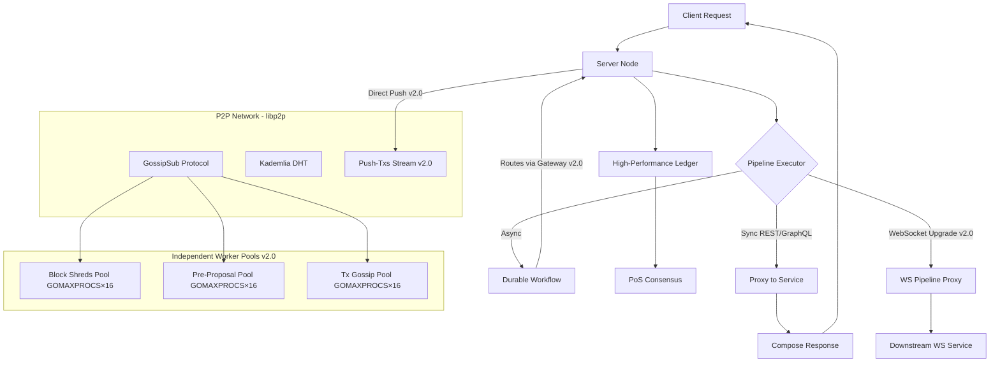

# 🚀 Grapthway Protocol v2.0

<div align="center">


**A Sovereign Execution Protocol for Decentralized Applications**

*Transform any Web2 service into a resilient, high-performance decentralized application without sacrificing performance or sovereignty.*

[](https://hub.docker.com/r/farisbahdlor/grapthway-protocol)
[](LICENSE.md)

[✨ What's New in v2.0](#-whats-new-in-v20) • [🎯 Quick Start](#-quick-start) • [🏗️ Architecture](#-architecture) • [💡 Core Concepts](#-core-concepts) • [📖 Documentation](#-documentation)

</div>

---

## ✨ What's New in v2.0

v2.0 is a substantial engineering release covering consensus reliability, pipeline correctness, worker routing, and developer tooling. **All v1.0 configurations, environment variables, pipeline definitions, and API endpoints are fully backward compatible** — no migration required.

---

### Breaking Changes

**None.** This is a drop-in upgrade.

---

### Detailed Change Log

#### 🐛 Fix — Assign Propagation to Context Header in Non-Durable REST Pipeline

**File:** `pkg/pipeline/executor.go`

`executeRESTRequest` internally re-declared `pipelineContext` as a new empty map, shadowing the caller's context. This caused all `BodyMapping` → query param resolution to return nothing, falling back to treating every mapped value as a static literal. The fix passes the real `pipelineContext` as an explicit parameter and removes the bogus local re-declaration. All three call sites (main step, rollback step) were updated.

---

#### 🐛 Fix — `ErrMissingBatchTxs` Race Condition (Block 22995-class Validator Halts)

**Files:** `pkg/ledger/ledger.go`, `pkg/p2p/p2p.go`

**Root cause:** Three compounding issues in the fallback block processing path (triggered when the block proposal arrives before its pre-proposal gossip is cached):

1. The pre-proposal cache poll window was only 50ms (5 × 10ms). Since `HandlePreBlockProposal` runs asynchronously, a ~5ms scheduling jitter was enough to miss the cache and fall through to the expensive `validateAndRecreateBatches` fallback.
2. `fetchTransactionsWithRetry` only pulled from the proposer with a 500ms timeout and had no fallback path to other validators.
3. `pushTransactionsToPeer` used `Gossip()` (fire-and-forget broadcast) rather than a targeted direct stream, making propagation state tracking unreliable.

**Changes:**
- `ledger.go` — Cache poll extended from a fixed 50ms to a **dynamic window**: 200ms default (20 × 10ms), scaling up to 600ms for blocks with >1000 txs. Zero impact on the cache-hit path which exits immediately via `goto foundInCache`.
- `ledger.go` — `fetchTransactionsWithRetry`: proposer timeout increased from 500ms to 1s; adds a fallback loop over other connected validators when the proposer pull is insufficient, rebuilding the still-missing list after each round.
- `ledger.go` — `fetchTransactionsWithRetry` now also tries the proposer when `proposerID == c.node.Host.ID()` (self-check removed to cover single-node edge cases).
- `p2p.go` — New libp2p protocol `/grapthway/push-txs/1.0.0` with `PushTxsProtocolID` stream handler and `PushTransactionsToPeer` direct stream method for targeted, confirmed transaction delivery.
- `ledger.go` — `pushTransactionsToPeer` updated to use the new direct stream with gossip as a fallback, so propagation state only reflects confirmed delivery.

---

#### 🐛 Fix — 71% Block Fallback Rate & Unbounded Goroutine Spawning

**Files:** `pkg/ledger/ledger.go`, `pkg/p2p/p2p.go`, `pkg/ledger/tokenBatch.go`

**Root cause (`listenForNetworkUpdates`):** A single goroutine handled all six pubsub message types in one `select` loop. `blockShredChan` messages were processed synchronously, enqueueing the block. `blockProcessingWorker` immediately started `processBlock` and its 50ms cache poll. Meanwhile `preProposalChan` was unread in its buffer, blocked behind tx and shred processing. `processBlock` exhausted its poll window and fell through to the slow fallback before `HandlePreBlockProposal` ever ran.

All worker pools scaled to `runtime.GOMAXPROCS(0) × 16` with a minimum of 8.

**`ledger.go` — `listenForNetworkUpdates`:**
Single goroutine replaced with **five independent worker pools**:
- `blockShredChan`: `GOMAXPROCS×16` dedicated workers — shred reassembly can never block the pre-proposal reader.
- `preProposalChan`: `GOMAXPROCS×16` dedicated workers — pre-proposals drain immediately off the wire regardless of tx gossip volume.
- `txChan`: `GOMAXPROCS×16` dedicated workers, each message dispatched to its own goroutine via `go HandleTransactionGossip`.
- `preValidatedTxChan`: `GOMAXPROCS×16` dedicated workers.
- `nonceUpdateChan` + `validatorUpdateChan`: single shared goroutine (low volume, no latency requirement).

**`ledger.go` — `GetLiveAccountStatesBatch`:**
Replaced unbounded goroutine-per-address with a `GOMAXPROCS×16` worker pool. Prevents goroutine explosion on large blocks touching hundreds of unique addresses.

**`ledger.go` — `ensureTransactionPropagation`:**
Replaced hardcoded semaphore of 5 with `GOMAXPROCS×16`.

**`ledger.go` — Deferred propagation cleanup & atomic deduplication:**
Added `pendingPropagationCleanup [][]string` and `cleanupMu sync.Mutex`. Propagation state is now cleaned up at `block - 1` (deferred one block) rather than immediately, preventing races under rapid block finalization. Atomic deduplication via `txPropagationState.LoadOrStore` prevents duplicate broadcasts and double-counted state at high TPS.

**`tokenBatch.go` — `ApplyTokenBatchToWriteBatch`:**
Six write sections (token creates, token updates, ownership records, absolute balances, allowances+deletes, history entries) now run as concurrent goroutines under `sync.WaitGroup`. The balance delta loop runs sequentially after the parallel phase (since deltas depend on absolute balances written in that phase), but the delta loop itself is also parallelized via a `GOMAXPROCS×16` worker pool.

**`p2p.go` — `SynchronizeMempool`, `RequestMissingTx`, `RequestChainTipQuorum`:**
All three replaced unbounded goroutine-per-peer with `GOMAXPROCS×16` worker pools. `RequestMissingTx` checks `queryCtx.Done()` before pulling each peer, preserving the scatter-gather early-exit semantic.

---

#### 🐛 Fix — Proposal Cache Miss Due to Missing `ProposalID` in Block Converter

**File:** `pkg/proto/converter/proto-to-model/block.go`

`ProposalID` was not mapped from the protobuf block to the model block in the proto-to-model converter. This caused `processBlock` to look up the cache with an empty key, always missing. One line added: `ProposalID: p.ProposalId`.

---

#### ✨ New — Deterministic Transaction IDs (`pkg/util/generateTxID.go`)

v1.0 used simple string concatenation for transaction IDs (`tx-genesis-<address>`, `tx-delegated-<unixNano>`). v2.0 introduces a SHA-256-based deterministic ID function:

```go
func GenerateTxID(prefix, sender, receiver string, amount uint64, timestampNano int64) string
// Returns: "<prefix><sha256(all fields)[:16 bytes hex]>"
```

Applied to all transaction sites: genesis allocation, delegated GCU transfers, delegated token transfers, rollback debit/credit. The `now` timestamp is now computed once per transaction and reused across `ID`, `Timestamp`, and `CreatedAt` fields, eliminating clock skew from repeated `time.Now()` calls.

---

#### ✨ New — Dynamic Path Variable Interpolation for REST Steps

**Files:** `pkg/pipeline/executor.go`, `pkg/workflow/worker.go`

Added `interpolatePathVars(path, ctx)` to both the pipeline executor and workflow worker. Replaces `$`-prefixed tokens in `step.Path` with values resolved from the pipeline context before building the request URL.

Supported syntaxes (multiple injections per path are supported):
```
$request.body.<field>  — from the original incoming request body
$args.<field>          — from GraphQL variables or REST query params
$<field>               — any bare context key from a prior assign step
```

Examples:
```
/api/$request.body.productId/product
/api/jobs/$jobId/logs
/api/$args.storeId/store/$args.productId/product
```

---

#### 🐛 Fix — GET Query Param Context Always Empty in `executeRESTRequest`

**File:** `pkg/pipeline/executor.go`

`executeRESTRequest` internally re-declared `pipelineContext` as a new empty map, shadowing the caller's context. This made GET `BodyMapping` → query param conversion always resolve nothing. Fixed by adding `pipelineContext` as an explicit parameter and removing the local re-declaration.

---

#### ✨ New — `request.body` and `args` Exposed in Pipeline Context for All Transports

**File:** `pkg/gateway/handler.go`

Ensures `$request.body.<field>` and `$args.<field>` resolve correctly across all three gateway entry points:

**REST `pipelinedProxy`:** Query params mirrored into both `"query"` and `"args"`. JSON body fields also placed into `"args"` when no query string is present.

**WebSocket `wsPipelinedProxy`:** Query params mirrored into both `"query"` and `"args"`.

**GraphQL Middleware:** `requestBody.Variables` now also exposed under `"request.body"` alongside the existing `"args"` key.

---

#### 🐛 Fix — Durable Workflow Assign Dot-Path Traversal Was Broken

**File:** `pkg/workflow/worker.go`

The assign loop in `ProcessDurableStep` only tried `stepResult[resKey]` (root) and one level of GraphQL envelope unwrap. Full dot-path traversal (e.g. `"data.product.id"`) silently dropped values in durable flows while working correctly in non-durable. Replaced with a three-priority resolution chain:
1. Root key lookup: `stepResult[resKey]`
2. Full dot-path: `getValueFromContext(stepResult, resKey)`
3. GraphQL envelope unwrap: unwrap `stepResult[step.Field]` then dot-path inside.

---

#### 🐛 Fix — GraphQL Operation Type Detection Too Narrow

**File:** `pkg/workflow/worker.go`

`executeGraphQLStep` heuristic only detected `"create"`, `"update"`, `"delete"` as mutations. Added `"insert"`, `"upsert"`, `"remove"`. Also honours `step.Method = "mutation"` as an explicit override alias so auto-detection can be bypassed.

---

#### ✨ New — Dynamic Developer Address Resolution in Service Key

**Files:** `pkg/pipeline/executor.go`, `pkg/workflow/worker.go`

Added `resolveServiceKey(service, ctx)` to both files. Resolves a `$`-prefixed variable in the developer-address portion of a composite service key before `ParseCompositeKey`. The service name (right of colon) is always a static literal.

Examples:
```
$request.body.seller_addr:product-svc  →  <resolved>:product-svc
$args.tenant_addr:order-svc            →  <resolved>:order-svc
```

Applied to all 4 `ParseCompositeKey` call sites across both files.

---

#### ✨ New — PATCH Method Support & Enhanced Route/Pipeline Matching

**File:** `pkg/gateway/handler.go`

- `PATCH` added to allowed HTTP methods in the REST proxy handler.
- **`matchRoutePattern`:** Segments starting with `:` in a registered pattern are treated as wildcards. `GET /api/admin/tiers/abc-123` matches pattern `GET /api/admin/tiers/:tier_id`.
- **`matchPipeline`:** Three-pass priority matching:
  1. Exact match (highest priority)
  2. Parameterised pattern match (`:segment` wildcards, longest pattern wins)
  3. Prefix match (retained for backward compat)

---

#### ✨ New — WebSocket Upgrade Compatibility for REST Proxy with Pre-Pipeline Support

**File:** `pkg/gateway/handler.go`

Added a fully pipeline-aware WebSocket upgrade path (`wsPipelinedProxy`). When `websocket.IsWebSocketUpgrade(r)` is detected on a pipelined REST route, the request routes to `wsPipelinedProxy` instead of `pipelinedProxy`. This ensures:
- The service's registered pre-pipeline (auth, billing) still runs on WebSocket connections.
- `?token=<jwt>` is promoted to the `Authorization` header before the pre-pipeline runs (browsers cannot set `Authorization` on a WebSocket upgrade handshake).
- Proxying uses `httputil.ReverseProxy` (supports `http.Hijacker`) rather than `http.NewRequest + http.Client` (which cannot complete a WebSocket handshake).
- `LoggingResponseWriter` gains a `Hijack()` method to forward hijacking to the underlying `ResponseWriter`.

---

#### ✨ New — Durable Workflow Steps Route Through Gateway (Pre-Pipeline Intact)

**File:** `pkg/workflow/worker.go`

`executeRESTStep` and `executeGraphQLStep` previously called upstream services directly, bypassing the gateway. v2.0 routes all durable workflow steps through a gateway node, ensuring:
1. The service's registered pre-pipeline (auth, billing) runs for durable steps — identical behaviour to non-durable pipeline calls.
2. The gateway's rate-limiting and middleware chain applies.
3. The request signature comes from a known gateway node, so downstream `GrapthwayMiddleware` accepts it.

A shared `pickGatewayInstance()` helper (up to 5 retries, internal/empty subgraph fallback) replaces the duplicated service discovery loops that previously existed in `executeCallWorkflowStep`, `executeRESTStep`, and `executeGraphQLStep`.

**REST routing URL pattern:** `{gatewayURL}/{developerAddress}/{servicePath}/{stepPath}`
**GraphQL routing URL pattern:** `{gatewayURL}/{developerAddress}/{subgraphName}/graphql`

---

#### ✨ New — Official Go & JavaScript SDKs (`sdk/`)

v2.0 ships the first official SDK release.

**Go SDK** (`sdk/golang/`):
- Multi-node support with automatic latency-based routing
- Automatic failover with exponential backoff (3 retries: 1s / 2s / 4s)
- Thread-safe `AccountManager` (`sync.RWMutex`)
- `NodePoolManager` with 30-second health check cycle
- Full API coverage: wallet, transfer, tokens, staking, allowances, workflows, logs
- HTTP middleware for downstream service request verification

**JavaScript/TypeScript SDK** (`sdk/javascript/`):
- Same multi-node failover logic as Go SDK
- Zustand-based account management (React-compatible store)
- Express middleware for request signing verification
- TypeScript types included (`grapthway-config.ts`, `grapthway-client-service.ts`)

---

## 🌟 What is Grapthway?

Grapthway is a **fully decentralized protocol** designed to manage, secure, and orchestrate communication between microservices. It eliminates the false choice between Web2 performance and Web3 sovereignty by combining:

- **Decentralized Orchestration** — Define complex, multi-step workflows in simple JSON that coordinate calls across GraphQL and REST services
- **Durable Workflows** — Execute long-running, asynchronous processes with guaranteed completion and automatic failure recovery
- **Incentivized Economic Layer** — A built-in, high-performance ledger with the **Grapthway Compute Unit (GCU)** token that creates a sustainable economy

Instead of relying on centralized databases or message brokers, Grapthway leverages a **peer-to-peer network** built on libp2p to create a resilient, scalable, and self-sustaining ecosystem.

---

## 🏗️ Architecture

Grapthway operates as a **hybrid Layer 1 protocol** where a purpose-built L1 blockchain handles economic settlement, token operations, and network security, while complex application logic runs on the highly scalable off-chain Sovereign Execution Layer.

### High-Level System Architecture


```mermaid
graph TD
    Client[Client Request] --> Server[Server Node]
    Server --> Pipeline{Pipeline Executor}

    Pipeline -->|Sync REST/GraphQL| Proxy[Proxy to Service]
    Proxy --> Response[Compose Response]
    Response --> Client

    Pipeline -->|WebSocket Upgrade v2.0| WSProxy[WS Pipeline Proxy]
    WSProxy --> Downstream[Downstream WS Service]

    Pipeline -->|Async| Workflow[Durable Workflow]
    Workflow -->|Routes via Gateway v2.0| Server

    subgraph P2P[P2P Network - libp2p]
        GossipBus[GossipSub Protocol]
        DHT[Kademlia DHT]
        PushTxs[Push-Txs Stream v2.0]
    end

    subgraph WorkerPools[Independent Worker Pools v2.0]
        ShredPool[Block Shreds Pool GOMAXPROCS×16]
        PrePropPool[Pre-Proposal Pool GOMAXPROCS×16]
        TxPool[Tx Gossip Pool GOMAXPROCS×16]
    end

    GossipBus --> ShredPool & PrePropPool & TxPool
    Server --> Ledger[High-Performance Ledger]
    Server -->|Direct Push v2.0| PushTxs
    Ledger --> Consensus[PoS Consensus]
```

### Node Roles

**Server Nodes (`server`)** — Public-facing entry points for API requests, execute synchronous orchestration pipelines, act as coordinators for durable workflows, participate in economic layer and consensus.

**Worker Nodes (`worker`)** — Headless background processors. In v2.0, execute durable workflow steps by routing through a gateway node so pre-pipelines run identically to non-durable calls.

---

## 💡 Core Concepts

### 1. Decentralized Orchestration

```json
{
  "service": "products-service",
  "schema": "type Query { getProduct(id: ID!): Product }",
  "type": "graphql",
  "middlewareMap": {
    "getProduct": {
      "pre": [{ "service": "auth-service", "field": "validateSession", "onError": { "stop": true } }]
    }
  }
}
```

### 2. Durable Workflows

In v2.0, every workflow step routes through the gateway — auth and billing pre-pipelines run for durable steps exactly as they do for non-durable calls.

```json
{
  "order.fulfillment.workflow": {
    "isWorkflow": true,
    "isDurable": true,
    "pre": [
      { "service": "payment-api", "method": "POST", "path": "/charge", "retryPolicy": { "attempts": 3, "delaySeconds": 60 } },
      { "service": "inventory-service", "field": "reserveItems", "onError": { "stop": true } }
    ]
  }
}
```

### 3. Dynamic Path Interpolation (v2.0)

REST step paths support `$`-variable injection at runtime:

```json
{ "service": "inventory-api", "method": "GET", "path": "/api/$args.storeId/products/$args.productId" }
```

```json
{ "service": "$request.body.tenant_addr:product-service", "method": "PATCH", "path": "/api/tiers/:id" }
```

### 4. Economic Layer

The **GCU token** powers all network operations.

**Staking Requirements**: `Required Stake = CPU Cores × 100 GCU`

### 5. P2P Architecture

- **GossipSub** — State updates and task announcements
- **Kademlia DHT** — Decentralized config and workflow state storage
- **Stake-Based Handshake** — Prevents Sybil attacks
- **Direct Streams** — Fast consensus messaging
- **Push-Txs Stream** *(v2.0)* — Confirmed direct transaction delivery between peers

---

## 🎯 Quick Start

### Prerequisites
- Docker and Docker Compose
- Basic understanding of GraphQL or REST APIs

### Step 1: Create Node Wallets

```bash
docker run -d -p 5000:5000 --name grapthway-temp farisbahdlor/grapthway-protocol-protocol:v2.0
curl -X POST http://localhost:5000/admin/wallet/create
# Save the privateKey! Repeat for each node.
docker stop grapthway-temp && docker rm grapthway-temp
```

### Step 2: Create `docker-compose.yml`

```yaml
version: '3.8'
services:
  grapthway-node-1:
    image: farisbahdlor/grapthway-protocol:v2.0
    ports: ["5001:5000", "40951:40949"]
    environment:
      - PORT=5000
      - P2P_PORT=40949
      - GRAPTHWAY_ROLE=server
      - NODE_OPERATOR_PRIVATE_KEY=YOUR_NODE_1_PRIVATE_KEY
    volumes: ["./data/node-1:/data"]
    networks:
      grapthway-net:
        ipv4_address: 172.20.0.10

  grapthway-node-2:
    image: farisbahdlor/grapthway-protocol:v2.0
    ports: ["5002:5000", "40952:40949"]
    environment:
      - PORT=5000
      - P2P_PORT=40949
      - GRAPTHWAY_ROLE=server
      - NODE_OPERATOR_PRIVATE_KEY=YOUR_NODE_2_PRIVATE_KEY
      - BOOTSTRAP_PEERS=/ip4/172.20.0.10/tcp/40949/p2p/NODE_1_PEER_ID
    volumes: ["./data/node-2:/data"]
    depends_on: [grapthway-node-1]
    networks: [grapthway-net]

  grapthway-worker-1:
    image: farisbahdlor/grapthway-protocol:v2.0
    environment:
      - GRAPTHWAY_ROLE=worker
      - P2P_PORT=40949
      - NODE_OPERATOR_PRIVATE_KEY=YOUR_WORKER_PRIVATE_KEY
      - BOOTSTRAP_PEERS=/ip4/172.20.0.10/tcp/40949/p2p/NODE_1_PEER_ID
    volumes: ["./data/worker-1:/data"]
    depends_on: [grapthway-node-1]
    networks: [grapthway-net]

networks:
  grapthway-net:
    driver: bridge
    ipam:
      config: [{subnet: 172.20.0.0/16}]
```

### Step 3: Launch

```bash
docker-compose up -d grapthway-node-1
docker logs grapthway-node-1  # copy the Peer ID
# Update BOOTSTRAP_PEERS, then:
docker-compose up -d
```

### Step 4: Verify

```bash
curl http://localhost:5001/admin/gateway-status
curl http://localhost:5001/admin/hardware-stats
```

---

## 📦 Publishing a Service Config

### JavaScript SDK (v2.0)

```javascript
import GrapthwayClient from './sdk/javascript/grapthway-client.js';
const client = new GrapthwayClient({
  nodeUrls: ['http://localhost:5001', 'http://localhost:5002'],
  privateKey: 'your_developer_private_key_hex'
});
await client.publishConfig({
  service: "my-service", url: "http://my-service:8000",
  schema: "type Query { hello: String }", type: "graphql", middlewareMap: {}
});
```

### Go SDK (v2.0)

```go
client, _ := grapthway.NewGrapthwayClient(&grapthway.ClientConfig{
  NodeURLs:   []string{"http://localhost:5001", "http://localhost:5002"},
  PrivateKey: "your_developer_private_key_hex",
})
client.PublishConfig(map[string]interface{}{
  "service": "my-service", "url": "http://my-service:8000", "type": "graphql",
})
```

Services are accessed at: `POST /{developer_wallet_address}/{service_name}/graphql`

---

## 🔧 Core Features

### Transactional Pipelines with Rollbacks

```json
{
  "createUser": {
    "pre": [
      {
        "service": "user-db-service", "field": "insertUser",
        "assign": { "newUser": "" },
        "onError": { "stop": true, "rollback": [{ "service": "user-db-service", "field": "deleteUserById", "argsMapping": { "id": "newUser.id" } }] }
      },
      { "service": "email-api-service", "method": "POST", "path": "/send-welcome-email", "bodyMapping": { "email": "newUser.email" }, "onError": { "stop": true } }
    ]
  }
}
```

### Conditional Execution

```json
{ "service": "audit-log-service", "method": "POST", "path": "/log-admin-action", "conditional": "user.role == 'admin'" }
```

### Built-in Token System

TOKEN_CREATE, TOKEN_TRANSFER, TOKEN_APPROVE/REVOKE, TOKEN_MINT/BURN, TOKEN_LOCK

---

## 📊 Performance & Scalability

On a modest 3-node cluster (2 vCPUs, 2GB RAM per node): ~500 TPS (token transfers), ~1000 OPS (aggregated operations). The v2.0 independent gossip worker pools and parallel `tokenBatch` writes are expected to significantly increase peak TPS under burst loads compared to v1.0.

---

## 🔒 Security Model

- **No Bearer Tokens** — All actions authorized by cryptographic signatures
- **ECDSA secp256k1** — Industry-standard signature verification
- **Stake-Based Admission** — Prevents Sybil attacks
- **Content-Addressed Storage** — Tamper-proof configurations

> ⚠️ Store private keys securely. Never commit to source control.

---

## 🛠️ Configuration Reference

| Variable | Description | Default |
|----------|-------------|---------|
| `GRAPTHWAY_ROLE` | Node role: `server` or `worker` | `server` |
| `PORT` | Public API port (server nodes only) | `5000` |
| `P2P_PORT` | libp2p network communication port | `40949` |
| `NODE_OPERATOR_PRIVATE_KEY` | Hex-encoded private key for node identity | Generated |
| `BOOTSTRAP_PEERS` | Comma-separated multiaddresses of bootstrap nodes | — |
| `LOG_RETENTION_DAYS` | Days to retain historical logs | `7` |
| `TLS_ENABLED` | Enable automatic HTTPS via Let's Encrypt | `false` |
| `TLS_DOMAINS` | Comma-separated domains for SSL certificate | — |
| `TLS_EMAIL` | Email for Let's Encrypt notifications | — |
| `TLS_CERT_DIR` | Directory to store SSL certificates | `/data/certs` |
| `TLS_STAGING` | Use Let's Encrypt staging server | `false` |
| `HTTPS_PORT` | HTTPS listen port | `443` |
| `HTTP_PORT` | HTTP listen port | `80` |

---

## 📈 Observability

Access Admin Dashboard at `http://localhost:5000/admin`: live log streaming, hardware monitoring, workflow tracking, ledger explorer, P2P topology.

```bash
GET /admin/gateway-status       # Network status
GET /admin/hardware-stats       # Hardware utilization
GET /admin/services             # Registered services
GET /admin/workflows/monitoring # Durable workflow states
GET /admin/logs/{type}          # Historical logs
```

---

## 📦 SDK Quick Reference (v2.0)

```go
// Go SDK
client, _ := grapthway.NewGrapthwayClient(&grapthway.ClientConfig{
  NodeURLs:   []string{"http://node1:5000", "http://node2:5000"},
  PrivateKey: os.Getenv("GRAPTHWAY_PRIVATE_KEY"),
})
balance, _ := client.GetBalance(address)
tx, _       := client.Transfer("0xRecipient", 10.0)
```

```javascript
// JavaScript SDK
const client = new GrapthwayClient({
  nodeUrls: ['http://node1:5000', 'http://node2:5000'],
  privateKey: process.env.GRAPTHWAY_PRIVATE_KEY
});
const balance = await client.getBalance(address);
const tx = await client.transfer('0xRecipient', 10);
```

**Service Verification Middleware** — both SDKs ship middleware that verifies incoming requests come from authorized Grapthway nodes only. See `sdk/golang/readme.md` and `sdk/javascript/readme.md` for full examples.

---

## 🔄 Migrating from v1.0

No migration required. Replace the Docker image tag:

```yaml
# Before
image: farisbahdlor/grapthway-protocol:decentralized-v1.0
# After
image: farisbahdlor/grapthway-protocol:v2.0
```

---

## 🚀 Production Deployment

### Kubernetes

```yaml
apiVersion: apps/v1
kind: Deployment
metadata:
  name: grapthway-server
spec:
  replicas: 3
  template:
    spec:
      containers:
      - name: grapthway
        image: farisbahdlor/grapthway-protocol:v2.0
        env:
        - name: GRAPTHWAY_ROLE
          value: "server"
        - name: NODE_OPERATOR_PRIVATE_KEY
          valueFrom:
            secretKeyRef:
              name: grapthway-keys
              key: node-key
        ports:
        - containerPort: 5000
          name: api
        - containerPort: 40949
          name: p2p
        resources:
          requests:
            cpu: 2
            memory: 4Gi
          limits:
            cpu: 4
            memory: 8Gi
```

### Best Practices

- Use Ingress Controller for TLS termination (NGINX, Traefik)
- Scale server and worker nodes independently
- Restrict downstream service access to Grapthway pods only
- Mount `/data` for ledger persistence
- Store private keys in Kubernetes Secrets or Vault

---

## 📚 Documentation

- 📄 [White Paper (EN)](white_paper_en.html) — Protocol vision and technical architecture
- 📄 [White Paper (ID)](white_paper_id.html) — Kertas putih teknis protokol
- 📖 [Engineering Manual](engineering_manual.html) — Complete technical reference
- 📦 [Go SDK Docs](sdk/golang/readme.md)
- 📦 [JavaScript SDK Docs](sdk/javascript/readme.md)

### Community

- 💬 [WhatsApp](https://chat.whatsapp.com/JeSmPrptaJY4IhZ7E3p1E1)
- 🐛 [GitHub Issues](https://github.com/Grapthway/Grapthway-Protocol/issues)
- 💡 [Discussions](https://github.com/Grapthway/Grapthway-Protocol/discussions)

---

## 📄 License

Grapthway is available under a custom software license. Read the full agreement: [LICENSE.md](LICENSE.md)

---

<div align="center">

**Transform your microservices into sovereign applications**

*Web2 Performance. Web3 Sovereignty. No Compromise.*

[](https://libp2p.io/)
[](https://golang.org/)
[](https://web3.foundation/)

</div>